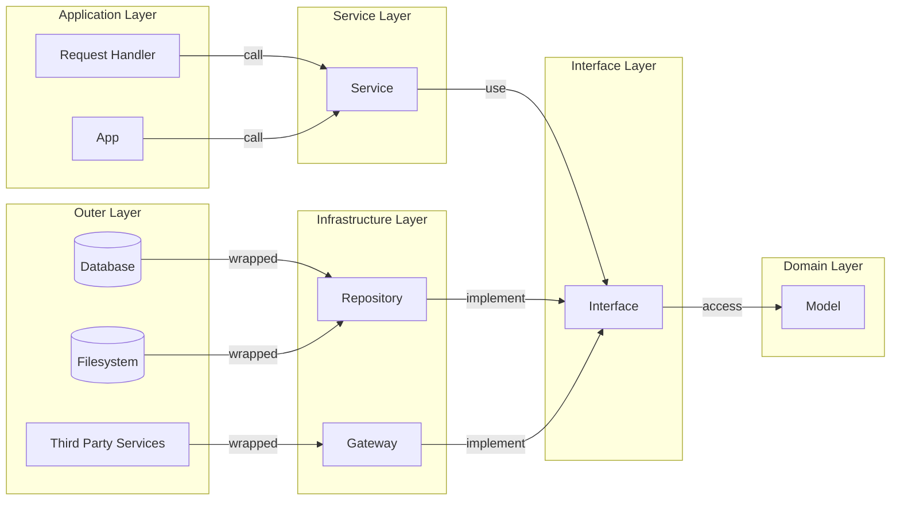

# Architecture

このアプリは Clean Architecture の原則に従って構成されています。

1. Domain モデルを外的要因から隔離すること
1. 外から内へのみ依存関係をみとめること

なお、以下の図にはまだ開発されていない領域が含まれます。

## 規約

Context, Logging, そして Error のプラクティスについて規約を決めています。以下参照のこと。

Context: [lib/context/README.md](lib/context/README.md)
Logging: [lib/logger/README.md](lib/logger/README.md)
Error: [lib/error/README.md](lib/error/README.md)
