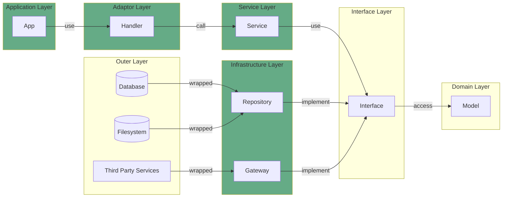
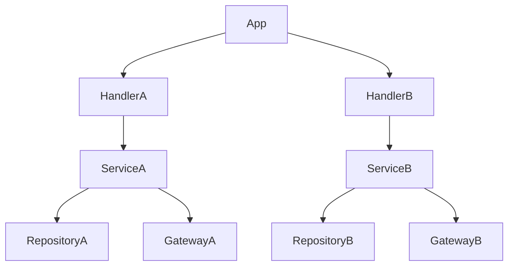

# Context

Context はアプリケーション内に分散し、各関数に情報を伝達します。 Clean Architecture の文脈で言えば、アプリケーションの使用に関して特有な情報のうち、「誰が」「どのように」といったメタ情報を保存し、各層へ継承します。例えば、 **認証情報** や **環境変数(local, dev, prod, etc)** などが当てはまります。ただし、「何が起きた」は Logging や Error の責務であり、 Context は管理しません。各関数は Context を引数に持つことで権限情報や環境変数などに依存することができます。

Context は以下の領域で使用されます。

## 継承とライフサイクル

最上位 Context は App 領域で定義されます。 App 領域では UserInfo などの情報を追加したうえで Handler 関数に Context を継承します。通常、1 つの Handler 関数に対して 1 つの Service 関数が呼び出され、さらに 1 つのサービスに対して複数の infrastructure が操作されます。このとき、以下のような木構造が構成されます。

## Info

`Info` は Context が保持する情報の基底インターフェースです。Context に追加するすべての情報は Info インターフェースを実装する必要があります。ログに含めたい内容を `toLogObject` メソッドに記述します。
