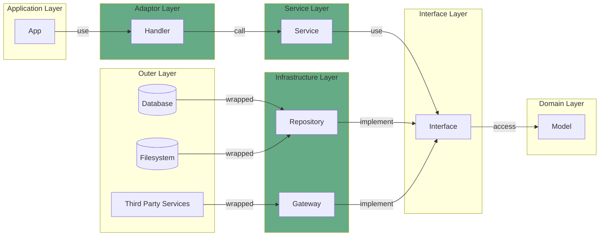

# Trace

OpenTelemetry 標準の Trace ライブラリをラップした関数群です。 Trace は Adaptor 層以下で使用され、 App 層では使用されません。



## ライフサイクル

Trace は Adaptor 層で初期化され、 Context を介してそれ以下の関数に分散します。通常、 1 つの Handler 関数は 1 つの Service 関数を使用し、 1 つの Service 関数は複数の Infra 関数を使用するため、次のような追跡が可能です。 Outer 層の追跡は Infra 層の関数がラップすることで実装します。

```mermaid
---
displayMode: compact
---
gantt
    title Trace Timeline
    dateFormat ss
    axisFormat %S

    section Handler
        Handler     :h1, 00, 15s

    section Service
        ServiceA  :s1, 00, 15s

    section Infra
        RepositoryA :r1, 00, 10s
        GatewayA :a1, after r1, 5s


    section Outer
        QueryA :q1, 01, 2s
        QueryB :q2, 05, 3s
        ApiA :api1, after r1, 1s
        ApiB :api2, 12, 2s
```



## Trace, Span の初期化

Trace は Adaptor 層で初期化されることを前提に、 `lib/init/starter.ts` にある `startHandler` 関数に初期化ステップを実装しています。 また、他の各 starter 関数は Span の初期化も実装されており、関数を終了する `end` 関数も返します。

```typescript
function someHandler(ctx) {
    const {context, end} = startHandler({ctx, "someHandler"}); // ← This initializes tracer and starts span

    someService.someMethod(ctx);
    end(); // ← This gets the span end
}

class SomeService{
    someMethod(ctx){
        const {context, end} = startService({ctx, "SomeService.someMethod"}); // ← This starts span

        someService.someMethod(ctx);
        end(); // ← This gets the span end
    }
}
```

## Cloud Trace と TraceProvider の初期化

これから書く。 src/instrumentation.ts に実装。
